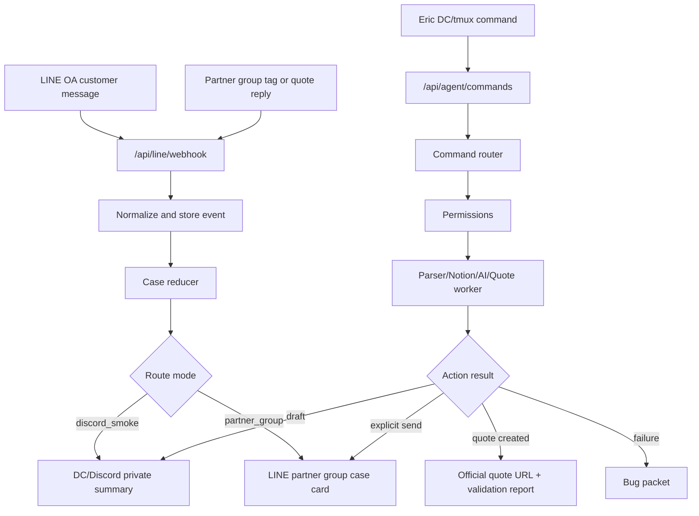

# LINE OA Travel Agent Engineering Plan

> **For Codex:** REQUIRED SUB-SKILL: Use superpowers:executing-plans to implement this plan task-by-task.

**Goal:** Build Chiangway Travel's internal AI assistant that receives official LINE OA messages, supports the partner LINE group, accepts Eric's private DC/tmux commands, reviews itinerary/quote drafts, traverses Notion/knowledge data, and later creates official quote URLs without auto-replying to customers.

**Architecture:** Add a separate `line-agent` layer inside the existing Next.js app. LINE, Discord/DC, Notion, AI model calls, parser review, quote creation, and audit logs communicate through one command router and case store, while existing itinerary/parser/Sanity pricing modules remain the source of truth.

**Tech Stack:** Next.js 14 route handlers, TypeScript, Sanity, Notion API, LINE Messaging API, internal DC command endpoint, optional Discord interactions, Vercel KV/Upstash-compatible storage, Anthropic/OpenAI model APIs, Vitest, Playwright/Puppeteer only for admin UI fallback automation.

---

## Current Repo Anchors

Use these existing files before inventing new behavior:

- `src/lib/itinerary/parser.ts` parses itinerary basics, days, and quotation text.
- `src/lib/itinerary/activity-matcher.ts` matches parsed activities to the activity database.
- `src/lib/itinerary/types.ts` defines parsed itinerary/quotation types.
- `src/sanity/tools/pricing/*` contains the formal quote calculator and saved quote state helpers.
- `src/sanity/tools/pricing/__tests__/*` is the existing pricing test style.
- `src/sanity/schemas/itinerary.ts` already has customer, trip, quote, includes/excludes, and raw itinerary fields.
- `src/lib/notion/client.ts` has an older private Notion dashboard adapter; the new 2026 team collaboration adapter must be separate.
- `src/lib/api-auth.ts` has existing internal API key validation and rate-limit patterns.
- `.env.example` currently needs LINE, DC, model, KV, and new Notion environment variables.
- `docs/plans/2026-06-01-line-oa-travel-agent-mvp.md` is the product spec for this engineering plan.

Important worktree note: the current repo has unrelated dirty/untracked files. Implementation must start on a branch or worktree and must not stage unrelated changes.

## Core Product Constraints

- No automatic customer replies in MVP.
- LINE OA webhook is an event source, not an inbox crawler; "unread" means unprocessed by the bot/team.
- Partner LINE group may ask the bot to analyze, OCR, web-search, parse, draft, and create bug packets.
- Partner LINE group may not directly edit repo code, deploy, change parser logic, or modify Sanity schema.
- DC/tmux is Eric's private operator plane. It may prepare messages for LINE, but posting to partner group requires explicit send intent.
- The bot must answer when tagged in the partner group and stay silent for casual chat.
- @Tsai/Lulu and @Chun/彥均 can both jump into cases; no owner assignment is required for MVP.
- Notion 2026 team collaboration is confirmed-case/reference data, not the unprocessed inbox.
- Private 2025/2026 Notion tables may be used later as Eric-private reference data, but should not be exposed directly to the partner group.
- Current facts such as openings, ticket rules, and closures require web search with sources and dates.
- Quote creation must return either a saved official URL plus validation report, or a bug packet with raw input, parser JSON, errors, and screenshots/logs when applicable.

## Harness Engineering Mapping

### Architecture Constraints

- Encode channel permissions in `src/lib/line-agent/permissions.ts`.
- Encode allowed command targets in tests: DC can post to LINE only with explicit send intent; LINE cannot post to OA customers.
- Encode case statuses in a reducer, not in ad hoc strings.
- Keep deterministic parsing, quote math, and include/exclude mapping in code and tests, not in prompts.
- Keep model prompts and skills as advisory playbooks; they must not be the only guardrail.
- Add CI-verifiable tests for parser golden cases, permission policies, route auth, and quote validation.

### Feedback Loops

- Use TDD for every route/handler/reducer.
- Add golden itinerary/quote fixtures from Eric's examples before implementation changes.
- Every failed quote automation emits a bug packet that CC/Codex can reproduce.
- Every official quote creation returns a validation report.
- Every model-extracted field includes confidence and source message IDs.
- Codex reviews CC's implementation diff before merge/deploy.

### Persistent Memory

- Product spec: `docs/plans/2026-06-01-line-oa-travel-agent-mvp.md`.
- Engineering plan: this file.
- Knowledge base: `docs/ai-agent-knowledge/**`.
- Case state: KV/Redis abstraction under `src/lib/line-agent/storage/**`.
- Audit log: append-only entries for webhook, command, cross-post, Notion write, quote create, and OCR actions.
- Optional progress file for long implementations: `docs/plans/2026-06-01-line-oa-agent-progress.json`.

### Entropy Management

- Keep one canonical knowledge folder; do not scatter travel rules into random docs.
- Add `docs/ai-agent-knowledge/README.md` with categories and maintenance rules.
- Add stale-case cleanup and raw-message retention policy before broad rollout.
- Mark old Phase 7 Telegram/LINE planning docs as historical if they conflict with this plan.
- Put model prompts/playbooks in skills, but keep schemas, math, permissions, and state transitions in TypeScript.

## Skill Strategy

Create these CC skills first so repeated messy work becomes consistent:

- `.claude/skills/chiangway-line-case-triage/SKILL.md`
- `.claude/skills/chiangway-itinerary-review/SKILL.md`
- `.claude/skills/chiangway-quote-review/SKILL.md`
- `.claude/skills/chiangway-notion-fill/SKILL.md`
- `.claude/skills/chiangway-ocr-extract/SKILL.md`
- `.claude/skills/chiangway-quote-automation-debug/SKILL.md`
- `.claude/skills/chiangway-web-research/SKILL.md`
- `.claude/skills/chiangway-release-review/SKILL.md`

Skill/code boundary:

- Skills can define judgment style, response format, escalation rules, and checklists.
- Code must define auth, permissions, state machine, parser validation, quote math, Notion field policy, and output schemas.
- If a skill result conflicts with TypeScript validation, TypeScript wins.

## Environment Variables

Add these to `.env.example` during implementation:

```env
# LINE
LINE_CHANNEL_SECRET=
LINE_CHANNEL_ACCESS_TOKEN=
LINE_PARTNER_GROUP_ID=
LINE_ROUTE_MODE=discord_smoke

# DC / Discord operator bridge
AI_AGENT_INTERNAL_SECRET=
DISCORD_PRIVATE_CHANNEL_ID=
DISCORD_BOT_TOKEN=
DISCORD_PUBLIC_KEY=

# Models
ANTHROPIC_API_KEY=
OPENAI_API_KEY=
AI_AGENT_DEFAULT_MODEL=
AI_AGENT_RESEARCH_MODEL=
AI_AGENT_VISION_MODEL=

# Notion
NOTION_TOKEN=
NOTION_TEAM_2026_DATABASE_ID=

# Storage
AGENT_KV_URL=
AGENT_KV_TOKEN=
AGENT_RETENTION_DAYS=90
```

Do not commit actual tokens. Eric already pasted a Notion token in chat once; do not copy it into repo files.

## Implementation Tasks

### Task 0: Protect The Worktree

**Files:**

- No source changes in this task.

**Steps:**

1. Run `git status --short`.
2. Create a branch or worktree, for example `codex/line-oa-agent-mvp`.
3. Confirm unrelated dirty files are not staged.
4. Commit only files touched by this plan in later tasks.

**Verification:**

- `git status --short` shows expected unrelated files, but `git diff --cached --stat` is empty before the first commit.

### Task 1: Add Chiangway Skills And Knowledge Skeleton

**Files:**

- Create: `.claude/skills/chiangway-line-case-triage/SKILL.md`
- Create: `.claude/skills/chiangway-itinerary-review/SKILL.md`
- Create: `.claude/skills/chiangway-quote-review/SKILL.md`
- Create: `.claude/skills/chiangway-notion-fill/SKILL.md`
- Create: `.claude/skills/chiangway-ocr-extract/SKILL.md`
- Create: `.claude/skills/chiangway-quote-automation-debug/SKILL.md`
- Create: `.claude/skills/chiangway-web-research/SKILL.md`
- Create: `.claude/skills/chiangway-release-review/SKILL.md`
- Create: `docs/ai-agent-knowledge/README.md`
- Create: `docs/ai-agent-knowledge/rules/family-pacing.md`
- Create: `docs/ai-agent-knowledge/rules/flight-and-car-time.md`
- Create: `docs/ai-agent-knowledge/rules/quote-included-excluded.md`
- Create: `docs/ai-agent-knowledge/cases/production-packages.md`
- Create: `docs/ai-agent-knowledge/restaurants-and-hotels.md`

**Steps:**

1. Write each skill with trigger, goal, inputs, output format, escalation rules, and "must not" constraints.
2. Add initial knowledge files from Eric's pasted examples:
   - family pacing
   - flight and car-time rules
   - quote include/exclude rules
   - package examples
   - restaurant/hotel categories
3. Keep Google Maps links as raw references for now; do not attempt bulk expansion in this task.
4. Commit the skills/knowledge skeleton separately.

**Verification:**

- Run `rg -n "auto-reply|customer|Notion|quote|LINE|DC" .claude/skills docs/ai-agent-knowledge`.
- Expected: each skill has explicit boundaries and relevant Chiangway wording.

### Task 2: Add Agent Config, Types, And Env Validation

**Files:**

- Modify: `.env.example`
- Create: `src/lib/line-agent/config.ts`
- Create: `src/lib/line-agent/types.ts`
- Create: `src/lib/line-agent/errors.ts`
- Create: `src/lib/line-agent/__tests__/config.test.ts`

**Steps:**

1. Write failing tests for missing LINE, DC, model, Notion, and KV config.
2. Define `AgentRouteMode = "discord_smoke" | "partner_group"`.
3. Define source/channel types: `line_oa`, `line_partner_group`, `discord_private`, `internal_worker`.
4. Define execution path types: `discord_cc`, `backend_worker_llm`, `line_api_llm`, `deterministic`.
5. Implement env parsing with safe defaults only for local development.
6. Run targeted config tests.
7. Commit.

**Verification:**

- Run `npm run test:run -- src/lib/line-agent/__tests__/config.test.ts`.

### Task 3: Add Case State Machine And Storage Interface

**Files:**

- Create: `src/lib/line-agent/cases/case-state.ts`
- Create: `src/lib/line-agent/cases/case-reducer.ts`
- Create: `src/lib/line-agent/storage/store.ts`
- Create: `src/lib/line-agent/storage/memory-store.ts`
- Create: `src/lib/line-agent/storage/kv-store.ts`
- Create: `src/lib/line-agent/audit/audit-log.ts`
- Create: `src/lib/line-agent/__tests__/case-reducer.test.ts`
- Create: `src/lib/line-agent/__tests__/memory-store.test.ts`

**Case statuses:**

- `new_inquiry`
- `needs_info`
- `ready_for_itinerary`
- `itinerary_in_progress`
- `itinerary_review`
- `ready_for_quote`
- `quote_review`
- `quoted_tracking`
- `added_eric`
- `converted`
- `lost`
- `idle`

**Steps:**

1. Write reducer tests for LINE OA message arrival, partner quote reply, itinerary posted, quote posted, added Eric, converted, lost, and idle.
2. Write duplicate-detection tests using LINE user ID, display name, dates, and recent-message window.
3. Implement in-memory store for unit tests.
4. Implement KV store behind the same interface, but keep tests mocked unless credentials exist.
5. Add audit events for state transitions.
6. Commit.

**Verification:**

- Run `npm run test:run -- src/lib/line-agent/__tests__/case-reducer.test.ts src/lib/line-agent/__tests__/memory-store.test.ts`.

### Task 4: Add LINE Webhook Adapter

**Files:**

- Modify: `package.json`
- Modify: `package-lock.json`
- Create: `src/app/api/line/webhook/route.ts`
- Create: `src/lib/line-agent/line/signature.ts`
- Create: `src/lib/line-agent/line/event-normalizer.ts`
- Create: `src/lib/line-agent/line/message-client.ts`
- Create: `src/lib/line-agent/__tests__/line-signature.test.ts`
- Create: `src/lib/line-agent/__tests__/line-event-normalizer.test.ts`

**Dependency:**

- Add `@line/bot-sdk`.

**Steps:**

1. Write tests for signature verification using a fixture secret/body/signature.
2. Write tests that normalize:
   - official OA user text message
   - partner group text message
   - quoted message
   - image/file message
   - unknown/casual group message
3. Implement `POST /api/line/webhook` with fast 200 response.
4. Reject invalid signatures.
5. Store normalized events and route them to the command/event router.
6. Do not call LINE mark-as-read.
7. Commit.

**Verification:**

- Run `npm run test:run -- src/lib/line-agent/__tests__/line-signature.test.ts src/lib/line-agent/__tests__/line-event-normalizer.test.ts`.

### Task 5: Add DC / Discord Operator Command Bridge

**Files:**

- Create: `src/app/api/agent/commands/route.ts`
- Create: `src/lib/line-agent/operator/operator-command.ts`
- Create: `src/lib/line-agent/operator/operator-auth.ts`
- Create: `src/lib/line-agent/operator/operator-response.ts`
- Create: `src/lib/line-agent/__tests__/operator-auth.test.ts`
- Create: `src/lib/line-agent/__tests__/operator-command.test.ts`

**Steps:**

1. Implement the internal HTTP command endpoint first because Eric already has a DC bot/tmux surface.
2. Secure it with `AI_AGENT_INTERNAL_SECRET`.
3. Accept actor, source channel, command text, optional case ID, and optional explicit send target.
4. Return a structured response that the DC bot can print back to Discord.
5. Add optional native Discord interaction route only after the internal bridge works.
6. Commit.

**Verification:**

- Run `npm run test:run -- src/lib/line-agent/__tests__/operator-auth.test.ts src/lib/line-agent/__tests__/operator-command.test.ts`.

### Task 6: Add Command Router And Permission Policy

**Files:**

- Create: `src/lib/line-agent/commands/router.ts`
- Create: `src/lib/line-agent/commands/intent.ts`
- Create: `src/lib/line-agent/commands/handlers.ts`
- Create: `src/lib/line-agent/permissions.ts`
- Create: `src/lib/line-agent/__tests__/permissions.test.ts`
- Create: `src/lib/line-agent/__tests__/command-router.test.ts`

**Steps:**

1. Write tests proving:
   - tagged partner group messages must get a response
   - casual partner group chat is ignored
   - OA customers never receive automatic replies
   - DC can post to partner group only with explicit send intent
   - LINE partner group cannot trigger code/deploy/parser-change commands
2. Implement permissions as pure functions.
3. Implement a deterministic router for known commands first.
4. Add LLM intent classification only as fallback.
5. Commit.

**Verification:**

- Run `npm run test:run -- src/lib/line-agent/__tests__/permissions.test.ts src/lib/line-agent/__tests__/command-router.test.ts`.

### Task 7: Add AI Model Gateway, Web Research, And OCR Interfaces

**Files:**

- Create: `src/lib/line-agent/ai/model-gateway.ts`
- Create: `src/lib/line-agent/ai/prompts.ts`
- Create: `src/lib/line-agent/ai/web-research.ts`
- Create: `src/lib/line-agent/ai/ocr.ts`
- Create: `src/lib/line-agent/ai/structured-output.ts`
- Create: `src/lib/line-agent/__tests__/model-gateway.test.ts`
- Create: `src/lib/line-agent/__tests__/ocr.test.ts`

**Steps:**

1. Write tests with mocked providers; no real API calls in tests.
2. Implement provider selection for default, research, and vision models.
3. Require source URLs and dates for current-fact web research output.
4. Require confidence/source fields for OCR extraction.
5. Add explicit escalation output when confidence is low.
6. Commit.

**Verification:**

- Run `npm run test:run -- src/lib/line-agent/__tests__/model-gateway.test.ts src/lib/line-agent/__tests__/ocr.test.ts`.

### Task 8: Add Notion 2026 Team Collaboration Adapter

**Files:**

- Create: `src/lib/line-agent/notion/team-collaboration.ts`
- Create: `src/lib/line-agent/notion/field-policy.ts`
- Create: `src/lib/line-agent/notion/notion-mapper.ts`
- Create: `src/lib/line-agent/__tests__/notion-field-policy.test.ts`
- Create: `src/lib/line-agent/__tests__/notion-mapper.test.ts`

**Steps:**

1. Do not modify `src/lib/notion/client.ts` unless a shared helper is truly reusable.
2. Write tests using fixture database schemas and fixture pages.
3. Classify Notion fields as `read_only`, `draft_write`, `confirmed_write`, or `manual_only`.
4. Add mapper from Notion page properties to case reference summary.
5. Add a read path for similar-case/reference search.
6. Add write path only for allowed fields with audit log.
7. Commit.

**Verification:**

- Run `npm run test:run -- src/lib/line-agent/__tests__/notion-field-policy.test.ts src/lib/line-agent/__tests__/notion-mapper.test.ts`.

### Task 9: Add Itinerary And Quote Review Harness

**Files:**

- Create: `src/lib/line-agent/quote/parse-review.ts`
- Create: `src/lib/line-agent/quote/validation-report.ts`
- Create: `src/lib/line-agent/quote/fixtures/chiang-mai-5d4n.txt`
- Create: `src/lib/line-agent/quote/fixtures/chiang-mai-quote-examples.txt`
- Create: `src/lib/line-agent/quote/fixtures/messy-quote-examples.txt`
- Create: `src/lib/line-agent/__tests__/parse-review.test.ts`
- Create: `src/lib/line-agent/__tests__/quote-validation-report.test.ts`

**Steps:**

1. Convert Eric's pasted itinerary/quote examples into fixtures.
2. Write tests that assert parsed days, meals, lodging, tickets, guide fee, insurance, totals, includes, excludes, and warnings.
3. Wrap existing `parseItineraryText`, `parseBasicInfoText`, `parseQuotationText`, and activity matching.
4. Add validation report severity: `ok`, `needs_human_check`, `blocked`.
5. Keep parser changes out of this task unless tests expose a small obvious bug.
6. Commit.

**Verification:**

- Run `npm run test:run -- src/lib/line-agent/__tests__/parse-review.test.ts src/lib/line-agent/__tests__/quote-validation-report.test.ts`.

### Task 10: Add Official Quote Creation API

**Files:**

- Create: `src/app/api/agent/quote/create/route.ts`
- Create: `src/lib/line-agent/quote/create-quote.ts`
- Create: `src/lib/line-agent/quote/sanity-write.ts`
- Create: `src/lib/line-agent/quote/quote-url.ts`
- Create: `src/lib/line-agent/__tests__/create-quote.test.ts`
- Create: `src/lib/line-agent/__tests__/quote-url.test.ts`

**Steps:**

1. Protect the route with existing internal API patterns from `src/lib/api-auth.ts`.
2. Accept raw itinerary text, raw quote text, case ID, actor, and source channel.
3. Run parser dry-run first.
4. Block write when report severity is `blocked`.
5. Create or update the Sanity quote/itinerary document only after validation passes.
6. Mark generated documents with `source = ai-agent` and `reviewStatus = needs_review` if schema support exists.
7. Return official quote URL plus validation report.
8. If schema support is missing, record that as a follow-up instead of forcing schema churn in this task.
9. Commit.

**Verification:**

- Run `npm run test:run -- src/lib/line-agent/__tests__/create-quote.test.ts src/lib/line-agent/__tests__/quote-url.test.ts`.

### Task 11: Add Admin UI Automation Fallback Interface

**Files:**

- Create: `src/lib/line-agent/quote/admin-driver.ts`
- Create: `src/lib/line-agent/quote/admin-driver-types.ts`
- Create: `src/lib/line-agent/quote/debug-artifacts.ts`
- Create: `src/lib/line-agent/__tests__/admin-driver-types.test.ts`

**Steps:**

1. Define the interface before implementing real browser automation.
2. Use direct Sanity/internal API by default.
3. Only enable CUA/Puppeteer driver for fields that cannot be safely written by API.
4. Require screenshots, step logs, and final URL capture from driver runs.
5. Never hide driver errors; convert them into bug packets.
6. Commit.

**Verification:**

- Run `npm run test:run -- src/lib/line-agent/__tests__/admin-driver-types.test.ts`.

### Task 12: Add Bug Packet And Feedback Artifacts

**Files:**

- Create: `src/lib/line-agent/debug/bug-packet.ts`
- Create: `src/lib/line-agent/debug/artifact-store.ts`
- Create: `src/lib/line-agent/__tests__/bug-packet.test.ts`

**Steps:**

1. Write tests for parser failure, quote math failure, admin fill failure, save failure, and validation failure.
2. Include raw input, normalized input, parser JSON, validation errors, event IDs, source channel, actor, execution path, screenshots/log references, and suggested reproduction steps.
3. Make command router return bug packet summaries to LINE/DC.
4. Commit.

**Verification:**

- Run `npm run test:run -- src/lib/line-agent/__tests__/bug-packet.test.ts`.

### Task 13: Add End-To-End Smoke Tests

**Files:**

- Create: `src/lib/line-agent/__tests__/agent-flow.test.ts`
- Optional create: `e2e/line-agent-quote-create.spec.ts`

**Steps:**

1. Test OA message -> case card event -> partner route.
2. Test partner tagged parse command -> parser report.
3. Test DC command -> draft partner message -> explicit send -> LINE push command call.
4. Test quote creation blocked on invalid parser report.
5. Test quote creation returns URL on valid mocked Sanity write.
6. Commit.

**Verification:**

- Run `npm run test:run -- src/lib/line-agent/__tests__/agent-flow.test.ts`.

### Task 14: Final Verification And Review

**Files:**

- Modify docs only if implementation changed behavior from the plan.

**Steps:**

1. Run full unit tests: `npm run test:run`.
2. Run lint: `npm run lint`.
3. Run build: `npm run build`.
4. Review `git diff --stat` and `git diff --cached --stat`.
5. Ask Codex for code review before merge/deploy.
6. Do not deploy until Eric confirms env vars and LINE/DC webhook endpoints are configured.

**Verification:**

- Full verification commands exit 0, or failures are documented with exact logs and follow-up tasks.

## Runtime Flow



## Suggested First Milestone

Milestone 1 should stop before official quote creation:

1. Skills and knowledge skeleton.
2. Config/types.
3. Case state/store.
4. LINE webhook adapter.
5. DC internal command bridge.
6. Router/permissions.
7. Parser review harness.

This gives Eric a real MVP for webhook, partner group replies, DC commands, and parser review without risking Sanity write automation too early.

## CC And Codex Collaboration Workflow

Recommended split:

1. Codex writes/updates product and engineering plans.
2. CC implements one milestone or task group on a branch/worktree.
3. CC runs targeted tests after every task and full checks at milestone end.
4. Codex reviews the diff with code-review stance.
5. Eric approves deploy and production env setup.
6. After deployment, the bot creates bug packets for operational failures instead of quietly guessing.

This two-agent workflow fits Harness Engineering: CC executes with constraints and tests; Codex acts as reviewer and second-order sanity check.
