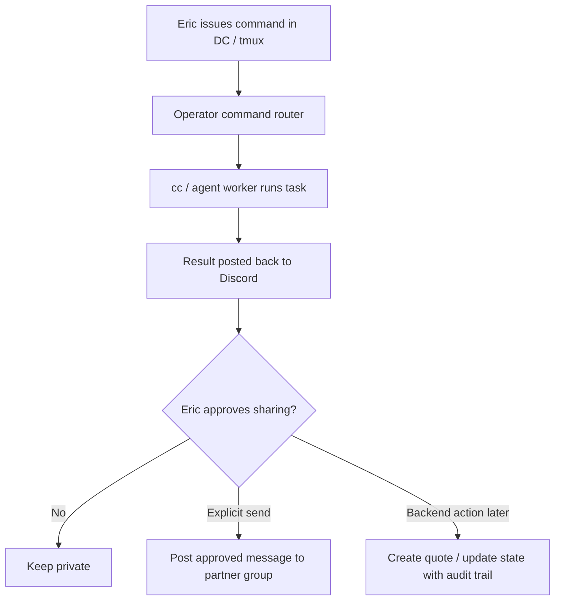
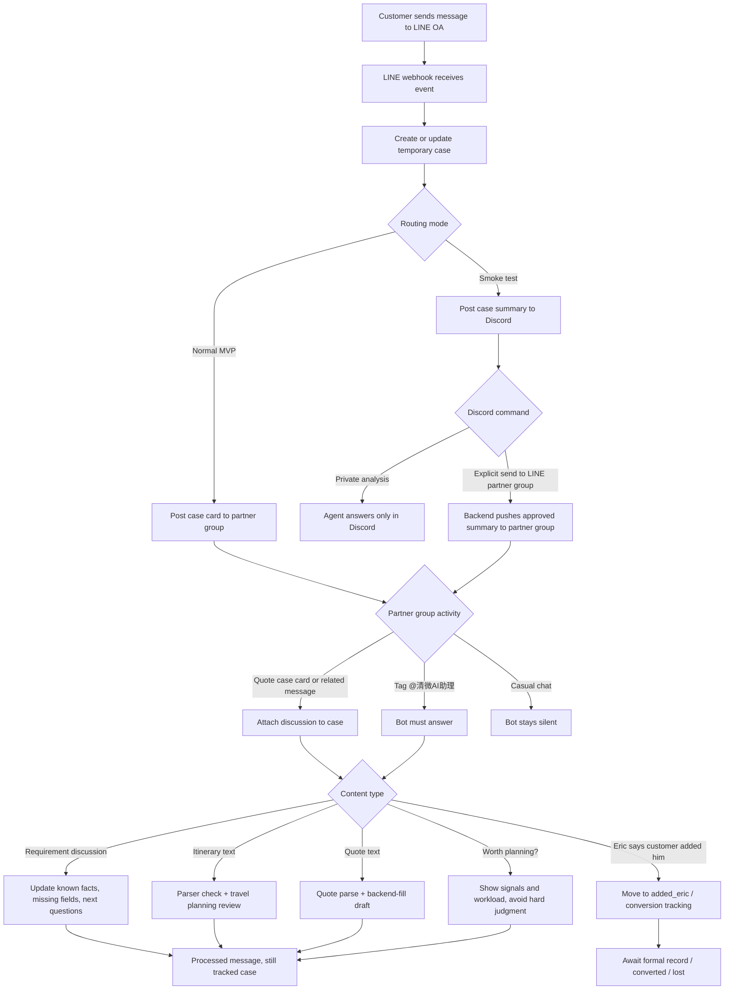

# LINE OA Travel Agent MVP

## Summary

Build an internal AI agent for 清微旅行 that connects three operating surfaces:

1. Discord private command plane: Eric + existing DC bot / tmux / cc, for private thinking and direct agent control.
2. LINE partner group: Eric + @Tsai + @Chun + bot, for daily case collaboration.
3. Official LINE OA: customer message event source.

Eric private LINE group is optional, not required for MVP. The preferred mode is DC -> shared backend -> LINE partner group when Eric explicitly asks the agent to post there.

The agent does not reply to customers. It receives LINE OA webhook events, creates internal case cards, follows quoted group discussions, checks missing requirements, parses itinerary and quote text, and helps the team review whether an itinerary/quote is ready for the next human step.

The product is not a generic ChatGPT LINE bot. It is the dedicated AI assistant for Eric and 清微旅行: an internal brand-aware travel operations assistant for Eric, @Tsai (Lulu), and @Chun (彥均), built around the real Chiang Mai custom itinerary workflow.

## Product Positioning

清微AI助理 should behave like the team's dedicated AI staff member, not like a generic chatbot.

It should understand:

- 清微旅行 brand background: Eric as Taiwanese dad, Min as Thai mom, a real Chiang Mai-based family.
- Service positioning: Chiang Mai family charter, custom travel planning, Chinese-speaking guide, driver/guide role separation.
- Customer expectation: trust, safety, clear planning, local expertise, and reassurance for family travel.
- Domain knowledge: Chiang Mai / Chiang Rai / North Thailand routes, family pacing, child seats, luggage/airport transfer, guide needs, tickets, restaurants, hotels, closures, seasonal markets, and quote logic.
- Business workflow: LINE OA inquiry, missing-information follow-up, itinerary design, quote review, official quote URL, customer adds Eric, confirmed case, Notion record.
- Team rhythm: @Tsai and @Chun can both jump into cases; Eric handles final judgment and hard cases; J姊 / 郭姐 are trusted external experts.

Voice and behavior:

- Internally professional, practical, and concise.
- Speaks with Chiangway context and travel-planning judgment.
- Flags uncertainty honestly, especially for current facts, pricing, safety, and young-child suitability.
- Gives the team next actions instead of vague commentary.
- Protects Eric-private context and customer-sensitive details.
- Never pretends to be the human owner; it supports Eric and the team.

## Goals

- Keep multiple LINE OA inquiries from getting mixed together in one group.
- Give Eric and the team a brand-aware AI assistant with Chiang Mai family-travel domain knowledge.
- Preserve 清微旅行's professional, trust-first planning style in internal suggestions.
- Separate Discord-private AI commands from partner-group operational discussion.
- Prevent private notes from being posted to the partner group unless Eric explicitly asks.
- Let Eric control cc / the agent from DC / tmux and route approved results to the LINE partner group.
- Help the team see what each customer has provided and what is still missing.
- Let the team keep using natural LINE habits, especially quoted replies.
- Parse itinerary text before it reaches the internal quote page, so attractions, restaurants, tickets, lodging, and notes are not missed.
- Parse quote text into a backend-fillable draft: day prices, guide fee, insurance, tickets, total, included items, excluded items, car time, overtime, and notes.
- Use Notion 2026 團隊協作 as the source of confirmed cases.
- Use repo Markdown files as a fast AI knowledge layer for rules, templates, restaurants, hotels, and package examples.
- Later, create the official quote URL automatically, return it to the LINE partner group or Discord review thread, and let humans adjust in Sanity if needed.

## Non Goals

- No automatic customer replies in MVP.
- No automatic mark-as-read calls in LINE OA.
- No Sanity quote creation in MVP A.
- No write-back to Notion until a later phase.
- No automatic judgment that a customer is "worth it" unless the team asks.
- No requirement that @Tsai or @Chun manually type case IDs every time.
- No full rewrite of the existing quote parser during the discovery phase.
- No cross-posting from Discord private command plane to LINE partner group unless Eric gives an explicit send command.
- No DC / tmux command may auto-reply to customers in official LINE OA.
- No uncontrolled shell access from chat commands; command execution needs an allowlist and audit trail.
- No LINE partner-group command may directly edit repository code, deploy, change parser logic, or alter backend feature behavior.

## Team Roles

| Role | Person | Responsibility |
|------|--------|----------------|
| Eric | Eric | Final judgment, hard cases, escalation to J姊 / 郭姐, conversion tracking |
| @Tsai | Lulu | Team member, can handle any case, ask customer follow-ups, prepare itinerary/quote |
| @Chun | 彥均 | Team member, can handle any case, ask customer follow-ups, prepare itinerary/quote |
| 清微AI助理 | Brand AI assistant | Case memory, missing-info checks, parser checks, itinerary/quote review, knowledge lookup, Chiangway domain guidance |
| J姊 / 郭姐 | trusted guides | External expert answers when Eric is unsure |

No owner assignment is required in MVP. @Tsai and @Chun can both jump into any case.

## Operating Surfaces And Routing

| Surface | Members | Purpose | Bot behavior |
|---------|---------|---------|--------------|
| Discord private command plane | Eric + existing DC bot / tmux / cc | Private command room, sensitive thinking, long-running agent tasks | Run private commands, return results in DC, never forward unless explicitly instructed |
| Official LINE OA | customers | Customer inquiry source | Receive webhook events only; no auto-reply in MVP |
| Partner group | Eric + @Tsai + @Chun + 清微AI助理 | Shared operations for inquiries, itinerary review, quote review, tracking | Post case cards, follow quoted replies, answer tags, warn about missing info |
| Eric private LINE group | Eric + 清微AI助理 | Optional mobile private command room | Not required in MVP; can be added later if mobile LINE confirmation is useful |

Default routing:

- New official LINE OA customer messages should create/update a case.
- In smoke-test mode, case cards can be routed only to Discord for Eric review.
- In normal MVP mode, case cards should route to the LINE partner group.
- Discord can command the shared backend to prepare a summary, then explicitly send it to the LINE partner group.
- Partner group discussion is the main operational record for unconfirmed cases.

Suggested explicit cross-post phrases from Discord:

```text
cc 把這段整理後發到 LINE 夥伴群
cc 發到夥伴群：請大家先補問小孩年齡和接送機
cc 幫我把王小姐這組整理成夥伴群提醒，先給我確認
```

The bot should confirm the exact partner-group message before sending when private notes include sensitive judgment, pricing uncertainty, or personal comments about the customer.

## Capability Boundaries

DC / cc bot and LINE bot are different tools with different strengths. They should not be treated as interchangeable.

| Capability | DC / cc bot | LINE bot |
|------------|-------------|----------|
| Private thinking with Eric | Strong | Optional only if Eric private LINE group is added later |
| Long-running cc / tmux work | Strong | Not appropriate |
| Repo/file/tool operations | Strong | Should request backend/worker to do it |
| Backend code changes, debugging, feature development | Strong via CC/Codex development workflow | Not allowed; can file bug packets or feature requests only |
| Traversing Notion, Sanity, Markdown, KV | Strong through backend/worker | Can ask backend for summaries, but should not do heavy work itself |
| Receiving official LINE OA events | Cannot do directly unless backend forwards events | Native responsibility |
| Reading LINE group quotes, mentions, message IDs | Cannot do directly unless backend stores LINE webhook events | Native responsibility |
| Sending to LINE partner group | Only through shared backend + LINE API | Native responsibility through LINE API |
| Team-visible discussion | Poor fit | Strong |
| Customer auto-reply | Not allowed in MVP | Not allowed in MVP |

Design rule:

- DC / cc bot is the private operator and heavy worker.
- LINE bot is the LINE event handler and team-room participant.
- Shared backend is the bridge: command router, case store, permissions, audit log, and LINE push API caller.

Examples:

- Eric says in Discord: "這個行程我改了 A/B/C/D，請通知夥伴群。" The DC bot should ask the shared backend/cc worker to traverse data, produce a clean message, then use LINE API to post to the partner group.
- @Tsai tags the LINE bot in partner group: "這份報價有沒有漏？" The LINE bot should attach the quoted message to the case, ask the backend/parser to review it, then reply in the group.

Billing / model routing implication:

- If the LINE bot directly calls Claude/OpenAI APIs, that uses API billing.
- If Discord commands invoke the existing cc/tmux path, that follows the billing/auth path of that cc setup.
- The backend should record which execution path was used: `line_api_llm`, `discord_cc`, or `backend_worker_llm`.

## Development And Operations Boundary

Operational automation and code changes must stay separate.

LINE partner group can request:

- read/fetch/analyze customer context
- web research with sources
- itinerary and quote review
- parser dry-run
- quote/admin automation
- Notion field fill / update when the target database and status allow it
- image/file OCR and extraction into structured fields
- bug packet creation when parsing, pricing, or automation fails
- feature request summaries for Eric

LINE partner group cannot directly:

- edit backend code
- change parser logic
- modify Sanity schema or quote calculation code
- run deployments
- install packages or change infrastructure
- approve its own automation bug fix

Notion write and OCR actions are operations, not code changes. They can be allowed with permissions, confidence scoring, and audit logs.

## Notion Field Fill And OCR

The agent should be able to help Eric and the partner team read, extract, and fill operational data.

Supported inputs:

- LINE customer text
- LINE partner group messages and quoted messages
- images/files sent to LINE group or LINE OA
- Notion pages and database rows shared with the integration
- Sanity quote/itinerary state when Phase 2 enables it
- pasted itinerary or quote text

Supported actions:

- OCR image/file content into text.
- Extract structured fields: customer name, dates, adults/children, child ages, luggage, pickup/dropoff, lodging, desired attractions, guide need, tickets, quote total, included/excluded items, notes.
- Fill a draft case record in KV.
- Create or update allowed Notion fields when the case status and permissions allow it.
- Attach original image/file reference, OCR text, confidence score, and extraction notes.
- Ask for human confirmation when confidence is low or a field affects price, safety, or confirmed booking data.

Suggested Notion write rules:

- Draft/working fields can be filled from LINE/Discord commands when the database is explicitly configured for operations.
- Confirmed-case fields should only be written after Eric or the team marks the case as confirmed / added_eric / converted.
- Formula and rollup fields should be treated as read-only outputs.
- Relation fields require the related database to be shared with the Notion integration.
- Every Notion write should store source message ID, actor, timestamp, and before/after summary.

OCR flow:

```text
LINE image/file webhook
→ fetch content by messageId
→ store temporary asset reference
→ OCR / vision extraction
→ structured JSON with confidence
→ fill KV draft or Notion fields if allowed
→ reply with extracted data and uncertain fields
```

Example response:

```text
[圖片 OCR 已整理]
#CW-0601-003｜王小姐

已讀取：
- 日期：2026/8/17-8/20
- 人數：7大3小
- 小孩：8y、5y、3y
- 車數：2台
- 導遊：1位

不確定：
- 3歲是否需要安全座椅
- 行李數沒有出現在圖片
- 住宿第二晚名稱不完整

已更新：
- KV draft：已更新
- Notion：尚未寫入，等待確認
```

Backend code changes, debugging, parser fixes, CUA driver fixes, and new features should go through the development lane:

```text
LINE bug packet or Eric/DC request
→ Discord / DC command plane
→ CC / Codex development session
→ code change + tests/debugging
→ deploy/release by Eric-approved workflow
→ LINE bot resumes using the updated backend capability
```

This keeps the partner group as an operations interface, while CC/Codex remains the place for code-level work.

## Operator Control Mode

Discord / tmux is Eric's command plane. It is not a customer channel and not the team discussion record.

Primary use cases:

- Eric issues a command in DC, the agent runs a task, then posts the result back to Discord.
- Eric asks the agent to inspect a case, parse pasted text, summarize Notion/Sanity context, or prepare a partner-group message.
- Eric tells the agent that an itinerary changed, asks it to traverse the relevant database/context, and produce a partner-facing update for @Tsai / @Chun.
- Eric uses DC/tmux for longer-running cc tasks while still receiving human-readable updates in Discord.

Default routing:

- DC/tmux command output goes back to Discord by default.
- Posting from DC/tmux output to the LINE partner group requires an explicit send command.
- Posting to official LINE OA customers is not allowed in MVP.

Suggested command examples:

```text
dc> cc 幫我整理王小姐目前缺什麼，回 DC
dc> cc parse 這份行程，檢查報價頁會不會漏景點
dc> cc 讀 2026 團隊協作，找類似 5 天親子行程案例，回 DC
dc> cc 這個行程我改了 A/B/C/D，請同步資料庫脈絡，整理給夥伴判斷，先給我確認
dc> cc 這個行程我改了 A/B/C/D，請 traverse Notion/Sanity/KV，直接發 LINE 夥伴群請她們處理
dc> cc 幫我產一段要發夥伴群的提醒，先給我確認
dc> cc 把剛剛確認的提醒發到 LINE 夥伴群
```

### Discord-to-LINE Sync Mode

When Eric issues a Discord command that says to notify LINE or sync with the LINE bot, the actual flow is:

```text
Discord bot
→ shared backend / command router
→ database traversal and cc/agent reasoning
→ optional Eric confirmation in Discord
→ LINE Messaging API pushMessage to partner group
```

The LINE bot and Discord bot should not talk to each other directly. They should share the same backend, case store, and command router.

This creates two decision modes:

| Mode | Where Eric asks | Audience | Best for |
|------|-----------------|----------|----------|
| Private operator mode | Discord / tmux | Eric only until explicitly sent | Sensitive judgment, messy thinking, database traversal, preparing a clean message |
| Team meeting mode | LINE partner group tag | Eric + @Tsai + @Chun | Shared decision, itinerary review, quote review, next-step alignment |

Recommended behavior for Discord sync commands:

1. Parse Eric's change summary, such as "I changed A/B/C/D".
2. Identify the target case by case ID, customer name, recent context, or pasted itinerary.
3. Traverse relevant sources: KV case state, Notion 2026 team collaboration, Markdown knowledge base, and later Sanity quote/itinerary state.
4. Produce a team-facing summary: what changed, what needs human judgment, what @Tsai/@Chun should do next.
5. If the command includes "直接發 LINE 夥伴群" or another approved send phrase, push the cleaned summary to the LINE partner group.
6. Otherwise, return the draft to Discord and wait for Eric's confirmation.

Control flow:



Every operator command that reads private context, writes data, or posts to a group should store actor, source, target, command text, result summary, and timestamp.

## Primary Workflow



## MVP User Stories

1. As Eric, I want every LINE OA customer message to create or update a case card in the LINE partner group or Discord smoke-test channel, so the team does not miss new inquiries.
2. As @Tsai or @Chun, I want the case card to show known facts, missing facts, and suggested follow-up questions, so I do not start planning from ambiguity.
3. As the team, we want quoted LINE replies to connect messages back to the right case, so we do not need to type a case ID every time.
4. As Eric, I want to ask `@清微AI助理 有什麼未處理？`, so I can see webhook-received messages that still need a next step.
5. As Eric, I want to ask `@清微AI助理 有什麼需要追蹤？`, so I can see processed cases that are not yet converted, lost, or idle.
6. As the team, when someone posts itinerary text, I want the bot to first check whether the internal parser can understand dates, days, stops, restaurants, lodging, tickets, and notes.
7. As the team, when someone posts quote text, I want the bot to summarize day fees, guide fees, insurance, tickets, included/excluded items, and totals, then flag math or currency problems.
8. As Eric, when I ask whether a case is worth deep planning, I want the bot to present signals and workload without pretending to know the customer's intent.
9. As Eric, when a customer adds my personal LINE, I want to tag the bot and move the case into conversion tracking.
10. As Eric, I want to use Discord/tmux as my private command plane, so I can ask cc sensitive questions or prepare a partner-group message before sending.

## Standard Case Card

```text
[LINE OA 新訊息]
#CW-0601-003｜王小姐｜狀態：問問看

客人原文：
「請問 4/12-16 清邁親子包車，4大2小怎麼安排？」

已知：
- 日期：4/12-4/16
- 人數：4大2小
- 需求：清邁親子包車

缺少：
- 小孩年齡
- 是否需要安全座椅
- 是否接送機
- 行李數
- 住宿地點
- 想去景點 / 餐廳
- 行程節奏偏輕鬆或排滿

下一步建議：
看到的人可先補問小孩年齡、安全座椅、接送機、住宿地點。
```

The posted LINE group message ID must be mapped to the case ID. Future quoted replies can then attach to the correct case.

## Bot Speaking Rules

Must respond:

- The bot is tagged.
- A case card is quoted and the message asks a question.
- A case-related itinerary or quote is posted for review.
- A LINE OA webhook event creates a new case card.

May proactively respond:

- A quote is being discussed while luggage, airport transfer, child seats, or guide inclusion is unclear.
- The itinerary looks too hard for young children.
- Multiple active cases are being mixed and the bot cannot determine which case the message belongs to.
- A case is stuck and the team explicitly asks for tracking.

Should stay silent:

- Casual chat.
- Pure emotional reactions.
- Stickers without business context.
- Clear human answer already exists and the bot adds no value.

Group-specific behavior:

- In Discord, the bot can answer broader/private strategy questions because the audience is only Eric.
- In Discord, the bot must treat cross-posting to LINE as a separate action that requires an explicit send phrase.
- In partner group, the bot should stay operational: missing info, itinerary review, quote review, case status, and next steps.
- In partner group, the bot should not expose Eric-private notes, private Notion tables, or private customer history unless Eric has explicitly shared that context there.

## Case State Model

Separate message handling from case tracking.

Message status:

- `unprocessed`: New customer message exists and no next step has been recorded.
- `processed`: The team or bot has identified the next step.

Case status:

- `inquiry_only`: casual inquiry / 問問看
- `missing_info`: information is not enough
- `waiting_customer`: team asked customer for missing details
- `ready_for_itinerary`: enough to draft an itinerary
- `itinerary_in_progress`: team is preparing itinerary
- `itinerary_review`: itinerary posted for review
- `quote_review`: quote posted for review
- `quoted`: quote sent to customer
- `waiting_customer_response`: waiting after quote/presentation
- `qr_sent`: Eric LINE QR sent
- `added_eric`: customer added Eric / messaged Eric
- `converted`: deal confirmed
- `lost`: not converted
- `idle`: no meaningful movement

Lost reasons to support later learning:

- price
- flights not confirmed / canceled
- hotel problem
- comparison shopping
- changing requirements
- no response
- chose another provider
- too urgent
- not fit for Chiangway service
- unknown

## Temporary Storage

Use Vercel KV / Redis for MVP temporary state.

Suggested keys:

```text
discord:channel:ericPrivate
discord:user:eric
line:group:partner
line:route:mode
operator:command:{commandId}
operator:index:recent
case:{caseId}
lineUser:{lineUserId}:activeCase
groupMessage:{messageId}
case:index:unprocessed
case:index:tracking
```

Suggested `case:{caseId}` payload:

```ts
interface LineAgentCase {
  caseId: string
  lineUserId: string
  customerDisplayName: string
  primaryDiscussionTarget: 'discord_private' | 'line_partner_group'
  primaryDiscussionTargetId: string
  messageStatus: 'unprocessed' | 'processed'
  caseStatus:
    | 'inquiry_only'
    | 'missing_info'
    | 'waiting_customer'
    | 'ready_for_itinerary'
    | 'itinerary_in_progress'
    | 'itinerary_review'
    | 'quote_review'
    | 'quoted'
    | 'waiting_customer_response'
    | 'qr_sent'
    | 'added_eric'
    | 'converted'
    | 'lost'
    | 'idle'
  createdAt: string
  lastCustomerMessageAt: string
  lastGroupDiscussionAt?: string
  knownFacts: Record<string, unknown>
  missingFields: string[]
  nextSuggestedQuestions: string[]
  itineraryDraft?: ParsedItineraryDraft
  quoteDraft?: ParsedQuoteDraft
  linkedGroupMessageIds: string[]
}
```

Suggested `groupMessage:{messageId}` payload:

```ts
interface GroupMessageRecord {
  messageId: string
  caseId?: string
  groupId: string
  groupRole: 'partner'
  senderLineUserId: string
  text: string
  quotedMessageId?: string
  createdAt: string
}
```

Suggested `operator:command:{commandId}` payload:

```ts
interface OperatorCommandRecord {
  commandId: string
  source: 'discord' | 'tmux'
  actor: 'eric'
  commandText: string
  executionPath: 'discord_cc' | 'backend_worker_llm' | 'line_api_llm'
  target:
    | 'discord_private'
    | 'partner_group'
    | 'sanity_quote'
    | 'notion'
    | 'ocr_extract'
    | 'notion_field_fill'
    | 'repo_code'
    | 'bug_packet'
    | 'feature_request'
    | 'read_only'
  caseId?: string
  status: 'queued' | 'running' | 'needs_confirmation' | 'completed' | 'failed'
  resultSummary?: string
  createdAt: string
  completedAt?: string
}
```

## LINE Behavior

The LINE Messaging API should be used as an event source, not an inbox crawler.

- Webhook can receive future customer messages.
- Webhook events must branch by `source.type`: official OA user events and LINE partner group events.
- Group events must store `source.groupId`, then verify it matches the configured partner group.
- The bot cannot list all historical LINE OA chats or true LINE OA unread conversations.
- "Unread" in product language should become "unprocessed by bot/team".
- MVP should not call mark-as-read.
- Existing customers not seen by webhook can be added manually by tagging the bot and pasting context.

Expected Discord private commands:

```text
cc 幫我 parse 王小姐，不要發 LINE
cc 有什麼未處理？
cc 有什麼需要追蹤？
cc 這組值得排嗎？先只回我
cc 這個行程我改了 A/B/C/D，traverse 資料庫後整理給我
cc 這個行程我改了 A/B/C/D，整理後通知 LINE 夥伴群讓她們判斷處理
cc 把這段整理後發到 LINE 夥伴群
cc 客人已加我
```

DC/tmux-originated messages posted back to Discord should be visibly labeled:

```text
[DC 指令結果]
來源：Eric / tmux
任務：parse 王小姐行程

摘要：
...

可選下一步：
- 回覆「發到夥伴群」才會轉發
- 回覆「重新檢查報價」可再跑一次
```

Expected partner group commands:

```text
@清微AI助理 幫我 parse 王小姐
@清微AI助理 有什麼未處理？
@清微AI助理 有什麼需要追蹤？
@清微AI助理 這組缺什麼？
@清微AI助理 幫我讀這張圖，整理成客人需求
@清微AI助理 把這組已確認資料填到 Notion
@清微AI助理 這份行程幫我檢查
@清微AI助理 這個報價有沒有漏？
@清微AI助理 這份行程建立正式報價連結
@清微AI助理 幫我上網查這個景點今天/這季有沒有異動，附來源
@清微AI助理 Eric 剛剛改了這段，請幫大家整理差異跟下一步
@清微AI助理 這組值得排嗎？
@清微AI助理 客人已加我
```

## Requirement Checks

Priority order:

1. Multi-day family custom itinerary
2. Chiang Mai day charter / one-day trip
3. Chiang Mai + Chiang Rai / North Thailand cross-region itinerary

Multi-day family essentials:

- travel dates
- duration
- arrival/departure time
- adults/children count
- child ages
- child seats
- lodging location
- airport/train transfer
- luggage count
- desired attractions / restaurants
- itinerary pace: light / normal / full
- elders, pregnancy, motion sickness, diet, mobility issues
- Chinese guide requirement
- budget signal / comparison context

Day charter essentials:

- date
- people count
- child ages
- pickup/dropoff
- desired stops
- usage hours
- child seats
- guide requirement

Chiang Rai / cross-region essentials:

- date and duration
- people count and child ages
- ability to accept long drive time
- same-day return or overnight
- desired stops
- luggage count
- vehicle type
- guide requirement
- lodging help

## Itinerary Parser Review

The itinerary text is both human-readable and later used as quote-page input. The bot must check parser completeness before travel quality.

Input patterns to support:

- Basic header: date, people count, car count, guide count
- Day header: `8/17（一）`, `Day 1｜...`, `Day1｜...`
- Departure time: `**8:30 出發**`, `9:00 出發`
- Bullets: `・`
- Meal lines: `午餐：`, `晚餐：`, `下午茶`
- Lodging lines: `住宿：`, `住:`
- Notes: `備註：`
- Google Maps links, when present, should attach to the previous place rather than become standalone attractions.

Review order:

1. Parser completeness
2. Parsed day/stops summary
3. Potential missed parse items
4. Itinerary reasonableness: family pacing, drive time, route, rest time
5. Quote readiness: tickets, meals, guide, vehicle, lodging, included/excluded

Example response:

```text
[行程解析檢查]
#CW-0601-003

整體：部分可解析

已解析：
D1：機場接機、換匯、Neng's、泰服、夜間動物園、Kung Yim、住宿
D2：大象保護營、黏黏瀑布、Samsen Villa、人妖秀、住宿

可能漏 parse：
- 「女生幾位化妝」應是待確認事項，不應算景點
- Google Maps 連結應綁到上一個地點
- 泰文餐廳名稱需原文保留

行程風險：
- 小孩 3 歲以下時，早班機 + 夜間動物園偏硬
- 水上樂園 + 夜間動物園同天需注意體力

建議先補：
- 小孩年齡
- 是否需要安全座椅
- 住宿地點
- 行李數
```

## Quote Parser Review

Quote parsing should be forgiving in input style and strict in validation.

Extract:

- day-by-day vehicle prices
- guide fee
- insurance
- ticket items and formulas
- included items
- excluded items
- total price
- currency
- car usage time
- overtime fee
- tip policy
- notes

Validate:

- date/year contradictions
- day fee math
- guide fee math
- ticket fee math
- subtotal and final total
- currency ambiguity, especially `元` vs `泰銖`
- whether guide fee is included twice or omitted
- whether ticket fees are included or on-site only
- whether "其餘門票現場買" is represented as excluded
- whether meals are included or customer-paid

Response format:

```text
[報價解析檢查]
#CW-0601-003

整體判斷：
部分可解析，建議先補 2 個資訊再進後台。

加總檢查：
- Day 車資：3700 + 4300 + 4300 + 0 + 700 = 13000
- 導遊費：7500
- 保險：400
- 小計：20900，正確
- 夜間動物園門票：3150
- 總計：24050，正確

疑似問題：
- 其餘門票未包含，需在不包含項目寫清楚。
- 餐費未列入，需標示現場自付。
- 導遊費是否含 3 天，已寫但建議在後台標明。

[後台填寫草稿]

包含：
✅ 油費
✅ 停車費
✅ 過路費
✅ 乘客保險
✅ 導遊費
✅ 夜間動物園門票

不包含：
- 餐費
- 其餘景點門票
- 小費
- 超時費

價格項目：
- Day 1 包車：3700
- Day 2 包車：4300
- Day 3 包車：4300
- Day 4 不包車：0
- Day 5 送機：700
- 導遊 3 天：7500
- 保險：400
- 夜間動物園門票：3150

總價：
24050 泰銖
```

## Knowledge Sources

### Markdown Knowledge Base

Use Markdown in the repo as the fast AI knowledge layer.

Initial file set:

```text
docs/ai-agent-knowledge/README.md
docs/ai-agent-knowledge/rules/family-pacing.md
docs/ai-agent-knowledge/rules/flight-and-car-time.md
docs/ai-agent-knowledge/rules/quote-included-excluded.md
docs/ai-agent-knowledge/cases/production-packages.md
docs/ai-agent-knowledge/restaurants-and-hotels.md
```

Content categories:

- family pacing rules
- flight arrival/departure rules
- car time and overtime rules
- quote included/excluded rules
- production packages from LINE rich menu
- city and regional itinerary examples
- restaurant recommendations
- hotel recommendations
- Eric rules
- J姊 / 郭姐 expert answers

Important extracted rules from current notes:

- Weekend markets are date-sensitive. 真心市集 and 椰林市集 should not both be defaulted unless customer asks.
- 長榮 / 華航 arrive in the morning and can support Day 1 touring.
- 亞航 often arrives late at night; Grab or point transfer may be better.
- 星宇 arrives later in the day; point transfer to hotel is usually enough.
- Chiang Mai car time is generally 10 hours.
- Chiang Rai car time is generally 12 hours.
- Black Forest restaurant closes Wednesdays.
- Baan Kang Wat closes Tuesdays.
- Point transfer usually counts as one-day price, but mountain / elephant resort / long-distance cases need manual judgment.

### Notion 2026 Team Collaboration

Use Notion 2026 團隊協作 as confirmed case data. It is not the unprocessed inbox.

Current URL:

```text
https://app.notion.com/p/32d37493475d8034b9c8f9754dc7ca52?v=32d37493475d81eea877000c4006ff76&source=copy_link
```

Likely database/page ID:

```text
32d37493475d8034b9c8f9754dc7ca52
```

First API traversal should:

1. Retrieve schema.
2. Identify fields for customer, needs, itinerary, quote, status, notes.
3. Pull 3-5 records.
4. Build a Notion-to-case-reference mapper.
5. Define which fields are safe and useful for similar-case search.

Notion 2025/2026 private customer tables are Eric-private. They may later become anonymized reference material, but should not be displayed directly in the team group.

### Bot Temporary Store

Use KV / Redis as source of processing state:

- Discord operator commands
- LINE group route IDs
- LINE OA webhook messages
- LINE image/file content metadata and OCR extraction outputs
- unprocessed cases
- quoted LINE group discussions
- itinerary drafts
- quote drafts
- state transitions
- cross-post audit trail from Discord private command plane to LINE partner group

## Notion API Handling

Never paste or commit Notion tokens. Use environment variables.

Suggested env:

```env
NOTION_TOKEN=
NOTION_TEAM_2026_DATABASE_ID=32d37493475d8034b9c8f9754dc7ca52
```

The integration has been created as `Chiangway AI Agent` and connected to the 2026 team collaboration page. If API calls fail with 404, first check that the database itself, not only a parent page, has been shared with the integration.

## Model Dispatch

Claude can be used through the Anthropic API. Claude subscription billing is separate from Claude API billing.

Recommended dispatch:

- Default for LINE partner group intelligence: use the best available model because incorrect travel/quote advice is more expensive than token cost.
- Simple deterministic tasks should still avoid LLM when possible: case lookup, status update, quote reply binding, parser dry run, arithmetic checks.
- Online/current facts: use web search with source links and dates; do not answer current hours, closures, or ticket rules from memory.
- Hard current facts, opening hours, ticket rules, and unusual pricing: verified source lookup first; escalate to Eric / J姊 / 郭姐 when uncertain.

The bot should not pretend certainty for unstable operational facts such as temporary closures, ticket policy changes, or unusual transfer pricing.

## Phase 2: Official Quote URL Creation

MVP A does not write Sanity. Phase 2 should create the real quote document and return the official customer URL to the LINE partner group or Discord review thread.

Flow:

```text
Team posts itinerary + quote
→ Bot parses itinerary and quote
→ Bot creates backend-fill draft
→ Bot writes official quote document / quote state
→ Bot returns official quote URL
→ Team checks page
→ If wrong, team adjusts in Sanity and saves
→ Same URL updates
```

Recommended implementation order:

1. Prefer direct backend/Sanity API or internal action endpoint for quote creation.
2. Use browser automation / CUA driver only when the admin UI has logic that is not available through a safe API yet.
3. Always run parser dry-run before writing.
4. Always return a validation report with the URL.
5. If automation fails or parser output is suspicious, return a bug packet to LINE/Discord instead of silently creating a bad quote.

LINE can be the main operation surface for the partner team. The actual execution should still happen in backend workers:

```text
@清微AI助理 這份行程建立正式報價連結
→ LINE webhook
→ command router
→ best model parses intent and checks missing fields
→ itinerary parser dry-run
→ quote parser dry-run
→ Sanity/internal API write, or CUA/admin driver fallback
→ preview/validation
→ official quote URL returned to LINE partner group
```

CUA / admin driver responsibilities, if needed:

- Open the internal quote/admin page.
- Paste or submit parsed itinerary text.
- Fill customer basics: customer name, dates, adults/children, child ages, luggage, transfer, lodging, guide requirement.
- Set route/day types and car count.
- Check included / excluded items.
- Fill ticket items such as night safari, elephant camp, water park, guide fee, insurance, and special notes.
- Save the quote.
- Read the final generated customer URL.
- Capture screenshots and state for debugging.

Parser and automation failure packet:

```text
[報價自動化失敗]
#CW-0601-003｜王小姐

失敗階段：
- itinerary_parse / quote_parse / admin_fill / save / validation

錯誤摘要：
- D3 景點沒有被解析：The Kad Farang Mae Rim
- 夜間動物園兒童票規則缺少身高資料

已取得：
- parser JSON
- 後台錯誤訊息
- 截圖 / step log
- 原始 LINE 貼文

建議：
- 人工補安全座椅與小孩身高
- 檢查 parser 對餐廳區的分類規則
```

Safety rules:

- Bot-generated quote documents should include `source = ai-agent`.
- Store `caseId`.
- Mark `reviewStatus = needs_review` if the schema supports it.
- Bot returns the URL only to the LINE partner group or Discord review thread.
- Bot never sends the URL to the customer.
- Bot should not mark quote automation as successful until it has a saved quote URL and validation report.
- Any automated quote should remain human-reviewable and editable in Sanity/admin.

Example internal response:

```text
[正式報價連結已建立]
#CW-0601-003

連結：
https://chiangway-travel.com/quote/xxxx

狀態：
已建立，但尚未人工確認。

後台解析：
- Day 數：5，OK
- 總價：24050 泰銖，OK
- 包含/不包含：已填入
- 夜間動物園門票：已計入

請人工確認：
- D3 The Kad Farang Mae Rim 是否要歸為餐廳區
- 住宿名稱是否完整
- 安全座椅是否需要補
```

## Rollout

Stage 1: Discord command plane + LINE partner group MVP

- LINE OA webhook receive.
- Discord private command room.
- Partner group case cards in normal MVP mode.
- Discord-only route mode for early smoke tests.
- DC/tmux operator commands can trigger cc work and return results to Discord.
- `@清微AI助理` response.
- Quote reply tracking.
- Itinerary and quote parsing as text only.

Stage 2: Knowledge-enhanced review

- Read Markdown knowledge base.
- Traverse Notion 2026 team collaboration.
- OCR LINE/Notion images and extract structured customer requirements.
- Fill allowed Notion working fields with audit logs.
- Find similar confirmed cases.
- Improve suggestions using production packages and rules.

Stage 3: Official quote document creation

- Create official quote document.
- Prefer direct API/internal action; use CUA/admin driver only when UI-only logic is required.
- Return official quote URL to group.
- Return validation report and bug packet when parsing/fill/save fails.
- Mark needs review.
- Human correction in Sanity remains the final control.

Stage 4: Conversion tracking

- Eric tags bot when customer adds him.
- Track added_eric, converted, lost, idle.
- Record lost reasons and workload signals.

Stage 5: Notion write-back

- Only after customer is confirmed.
- Write required fields into team Notion.
- Include itinerary, cost, quote, status, notes, profit sharing if applicable.

## Success Criteria

MVP A is successful if:

- 清微AI助理 behaves like Chiangway's internal brand AI assistant, not a generic chatbot.
- New LINE OA messages appear in the partner group within a few seconds in normal MVP mode.
- New LINE OA messages can be routed only to Discord during smoke tests.
- Eric can ask sensitive/private questions in Discord without posting to the partner group.
- Eric can issue a DC/tmux command and receive the cc result in Discord.
- The bot only sends from Discord to LINE partner group when Eric explicitly asks.
- Eric can ask Discord to traverse case/context data after itinerary changes and either draft or send a clean partner-group update.
- The same case state can be operated from Discord privately or from LINE partner group publicly without creating duplicate cases.
- DC / cc bot and LINE bot have separate capability boundaries, with shared backend deciding what each surface can request.
- Each operator command records its execution path for billing/debugging: `discord_cc`, `backend_worker_llm`, or `line_api_llm`.
- LINE partner group can create bug packets or feature requests, but code changes and debugging stay in CC/Codex development workflow.
- DC/tmux commands cannot send anything to official LINE OA customers.
- Multiple active customers do not get mixed up when team members quote case cards.
- The bot ignores casual group chat.
- The bot reliably answers when tagged.
- Partners can ask the LINE bot to use the best model for research/review, with web sources when current facts are requested.
- Partners can ask the LINE bot to OCR images/files and extract customer requirements with confidence flags.
- Allowed Notion fields can be filled from confirmed structured data, with source/audit trail.
- The bot identifies missing child age, car seat, luggage, transfer, lodging, and guide/ticket fields.
- Itinerary parser checks catch likely missed attractions/restaurants/lodging/notes.
- Quote parser checks catch math, ticket, included/excluded, currency, and total issues.
- Quote automation returns either a saved official URL plus validation report, or a clear bug packet with failure stage and artifacts.
- @Tsai and @Chun can understand the next step faster without needing Eric for every basic question.

## Open Questions

- Which LINE group ID is the partner group?
- Which Discord private channel ID should receive cc results?
- What exact command phrase is explicit enough to authorize sending from Discord to LINE partner group?
- What is the existing DC bot command format and how does it connect to tmux?
- Should DC/tmux commands call the same HTTP endpoint as LINE commands, or use a separate internal-only endpoint?
- For "traverse database", what should the default source order be: KV active case, Notion 2026, Markdown knowledge, then Sanity?
- Which LINE display names/user IDs map to Eric, @Tsai, and @Chun?
- Which existing quote parser/state model should Phase 2 call?
- Does the quote/admin page have an internal API for all fields, or are some fields UI-only and require CUA/browser automation?
- What validation rules define "safe enough to return URL": parser completeness, included/excluded match, price total, ticket items, and saved URL?
- Does the Sanity quote schema already support `source` and `reviewStatus`, or should those fields be added later?
- What should the bug packet format include so CC/Codex can reproduce parser/admin-driver failures quickly?
- Which Notion fields are safe for auto-fill, draft-fill, or read-only?
- Which image/file types should OCR support first: LINE images, screenshots, PDFs, or Notion attachments?
- What retention period should KV use for raw customer messages?
- Should Markdown knowledge be manually maintained first, or synced from Notion later?
- How should Google Maps short links be expanded into names/categories for the knowledge base?

## Immediate Next Inputs

- LINE Channel Secret and Channel Access Token, via local env only.
- Partner LINE group ID.
- Discord bot token / private channel ID, via local env only.
- Existing DC bot / tmux command pattern, including how cc is currently invoked.
- Vercel KV / Upstash credentials.
- Notion token in `.env.local`, not in chat.
- 3-5 benchmark customer messages.
- 3 itinerary examples that should parse successfully.
- 3 quote examples that should parse successfully.
- 2 intentionally messy examples for parser failure testing.
